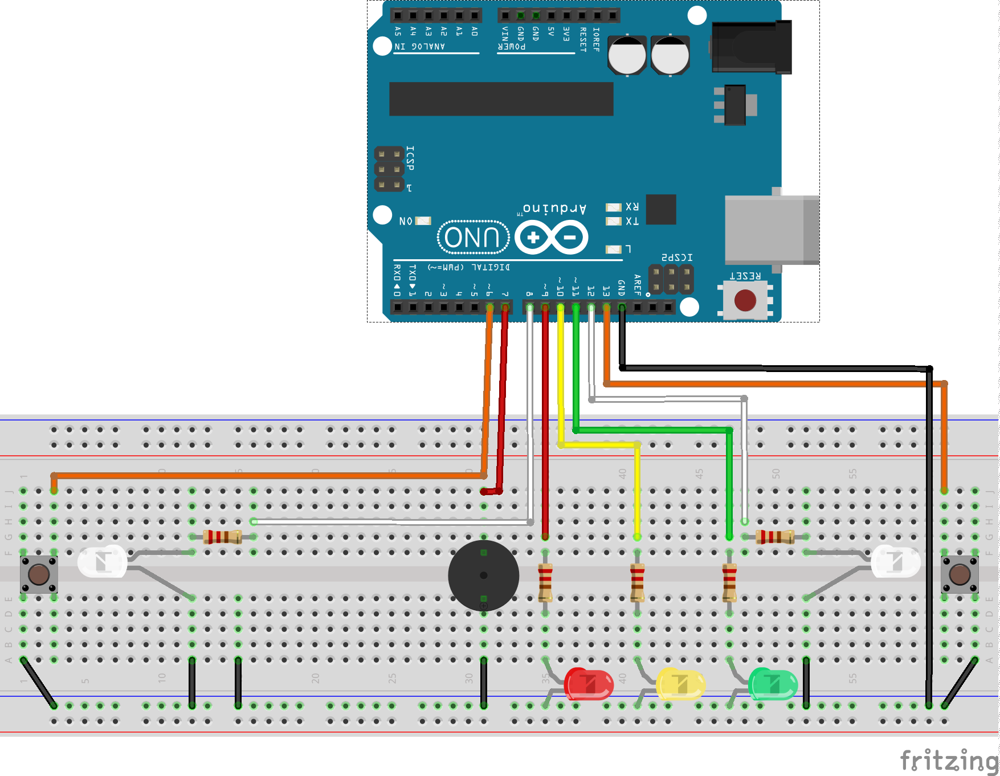

## Reaction Speed Game – Arduino ##

A simple two-player reaction-speed game built with Arduino. LEDs act as a countdown, and players race to press their button first after the red light turns off.

# How the Game Works #

Countdown

Green LED on → short buzzer beep

Yellow LED on → short buzzer beep

Red LED on → short buzzer beep

Random Delay

The red LED stays on for a random time (900–4900 ms).

Reaction Phase

Both player LEDs turn on.

Players press their button.

Button 1 turns off Player 2’s LED.

Button 2 turns off Player 1’s LED.

The first LED to turn off shows the winner.

Round End

Long buzzer beep.

LEDs reset and a new round begins.

# Pin Connections #
Component	Pin
Player LED 1 (yellowLED1)	12
Player LED 2 (yellowLED2)	8
Green LED	11
Yellow LED	10
Red LED	9
Buzzer	7
Button 1	13 (INPUT_PULLUP)
Button 2	5 (INPUT_PULLUP)

# Features #
Random reaction start time
Two-player competitive gameplay
Winner indicated visually
Simple LED + buzzer interface

